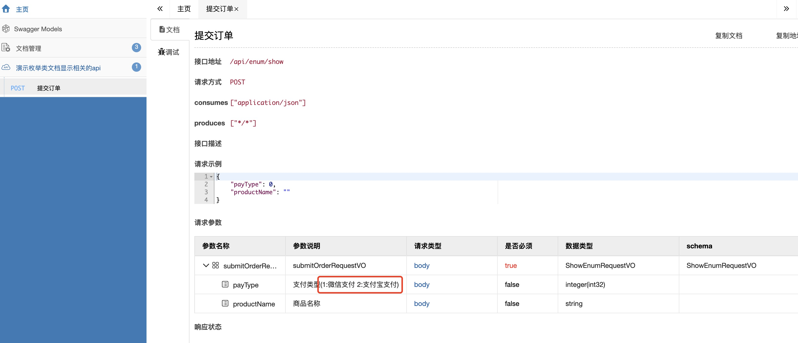

# swagger-tool-plugin

## 1. 显示枚举类的文档描述信息

>> 注意:需要开启swagger,在配置文件中设置如下参数即可:
>  swagger.enable = true

~~~java
// 在需要显示枚举描述信息的属性上添加@ShowEnumDoc注解并指明是哪个枚举类
@Data
@ApiModel("ShowEnumRequestVO")
public class SubmitOrderRequestVO {

    @ApiModelProperty(value = "支付类型")
    @ShowEnumDoc(enumClass = PayTypeEnum.class)
    private Integer payType;

    @ApiModelProperty(value = "商品名称")
    private String productName;
}
~~~

效果图如下:  

